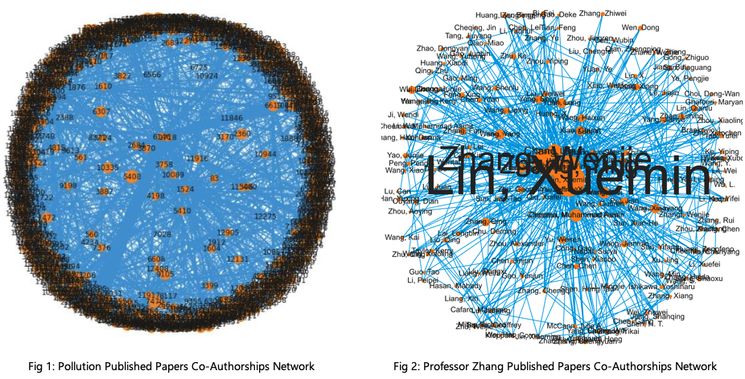

# Social-Information-Network-Analysis - UTS Autumn 2021

Submission for The Invincibles group assigment is in A3_Submit folder - notebook, source data, output files.

1. Geoffrey Watkins
2. Mark Cepak
3. Carol Paipa

Our group, **The Invincibles**, are undertaking two tasks for our SINA group project submission.
 
• Network analysis and visualization - Analysing an interesting network from different aspects, such as degree distribution, network centrality, community detection, network evolution and graph visualization.

• Algorithm - A scalable implementation of an algorithm for processing massive graphs that solves real problems.

We have analysed 2 main research published paper networks, and created a random forest algorithm to predict future researcher relationships. We found that the 3 networks encountered different challenges in cleaning, understanding and preparing the data for modelling.

1. Pollution papers - there were many non-connected networks in the relationships between papers and co-authors, which provided less data for generating useful features.
2. Professor Zhang papers - was a very well-connected network between papers and co-authors, that allowed for more meaningful features to be engineered for the model

Filtering on papers and author selection is important, as we discovered identifying large co-authorships with co-authors that have also worked on many papers, leads to exponentially large adjacency matrix's and A1,A2 parings, that really impacts the development of model with our limited local CPU resources (note: required AWS or Google Colab, for example).

One main problem with research citation data, is that authors can have multiple name variations, which this model does not address, and is also not commonly addressed in other networking tools (Gephi, VOS). Thus indicating that further research on this particular topic would be highly valuable.

Quick view of the two types of networks our project has investigated and develop/tested our random forest model on.

Image 1 - Pollution published papers co-authorships

Image 2 - Professor Zhang published papers co-authorships

